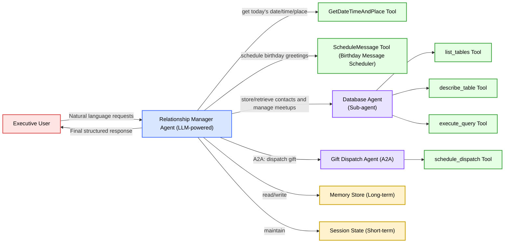

# 🤝 Relationship Manager Agent for Busy Executives

**A multi-agent AI system that remembers birthdays, tracks meetups, drafts messages, and dispatches gifts — built with Google ADK.**

---

## 📌 Overview

Busy executives interact with dozens of clients, founders, investors, and colleagues every month.
Maintaining these relationships consistently — remembering birthdays, planning follow-ups, sending thoughtful notes — requires time and mental bandwidth they simply don’t have.

This project implements a **Relationship Manager Agent**, an AI-powered personal CRM assistant built using the **Google Agent Development Kit (ADK)**.

The system:

* Stores and retrieves contact information
* Schedules birthday messages
* Plans meetups and catch-ups
* Suggests gift and message ideas
* Dispatches gifts using a remote A2A sub-agent
* Maintains session state and long-term memory

Everything happens through a single conversational interface.

---

## 🚀 Features

### ✔ Multi-Agent Architecture

* **Main Relationship Manager Agent**
* **Database Agent** (Sub-agent)
* **Gift Dispatch Agent** (A2A)

### ✔ Custom Tools

1. `get_datetime_and_place_for_today`
2. `schedule_message`
3. `schedule_dispatch` (gift tool)
4. `list_tables`
5. `describe_table`
6. `execute_query`

### ✔ Sessions & Memory

* Stores state across turns
* Persists context
* Keeps track of prior interactions

### ✔ Observability

* Logging plugin
* Agent card
* Tool-level traces
* Event compaction

### ✔ A2A Communication

* Database Agent and Gift Dispatch Agent run as remote microservices
* Main agent communicates with them via HTTP seamlessly

---

## 🏗️ Architecture

Below is the high-level architecture of the system:



---

## 📂 Repository Structure

```
.
├── relationship-manager-agent-for-busy-executives-capstone.ipynb
├── README.md
├── /img
│   ├── architecture-diagram.png
│   └── database-agent-seq_diag.png
│   └── gift-dispatch-agent-seq_diag.png
```

---

## 🛠️ Installation

### **1. Clone the repository**

```bash
git clone https://github.com/apargarg/relationship-manager-agent-for-busy-executives.git
cd relationship-manager-agent-for-busy-executives
```

### **2. Install dependencies**

You must enable Google ADK:

```bash
pip install google-generativeai
pip install google-adk
pip install uvicorn
pip install fastapi
pip install sqlalchemy
```

### **3. Set Google API Key**

```bash
export GOOGLE_API_KEY="your-key-here"
```

---

## 🧰 Key Code Snippets

### **Database Agent Setup**

```python
database_agent = LlmAgent(
    name="database_agent",
    description="Handles SQL queries for people and meetups.",
    tools=[list_tables, describe_table, execute_query],
)
```

### **Gift Dispatch Agent**

```python
def schedule_dispatch(sender_name, recipient_name, address, delivery_date, item):
    return f"Gift '{item}' scheduled for {recipient_name} on {delivery_date}."

gift_dispatch_service_agent = LlmAgent(
    name="gift_dispatch_service_agent",
    tools=[schedule_dispatch],
)
```

### **Main Relationship Manager Agent**

```python
relationship_manager_agent = Agent(
    name="relationship_manager_agent",
    tools=[get_datetime_and_place_for_today, schedule_message],
    sub_agents=[database_agent, remote_gift_dispatch_agent],
)
```

---

## 💬 Example User Interactions

**User:**
“Add John Doe. His birthday is February 14.”
**Agent:**
“Added John Doe to the database.”

---

**User:**
“Schedule a birthday message for him at 9 AM.”
**Agent:**
“Message scheduled for Feb 14 at 9 AM.”

---

**User:**
“Send a wine bottle to Rohit on his birthday.”
**Agent:**
“Gift dispatch confirmed: Delivery scheduled for July 6.”

---

## 🎥 Demo Workflow (Video Script Provided)

A full 3-minute YouTube script is included that walks through:

* Problem
* Why agents
* Architecture
* Demo
* Impact

You can use it to record the Capstone submission video.

---

## 🔮 Future Work

1. **Integrate real APIs**

   * Gmail
   * WhatsApp Business
   * Google Calendar

2. **Production-grade gift dispatching**

   * Amazon
   * Sendoso
   * Corporate vendors

3. **Smarter relationship intelligence**

   * Engagement scoring
   * Recency/frequency insights

4. **Natural language SQL**

   * LLM-to-SQL translation
   * Temporal queries (“people I met last quarter”)

5. **Cloud deployment**

   * Google Cloud Run
   * Agent Engine

---

## 🏅 Acknowledgements

This project was built as part of the **5-Day AI Agents Intensive Course with Google**, demonstrating multi-agent orchestration, custom tools, A2A protocol, memory, sessions, and observability.
